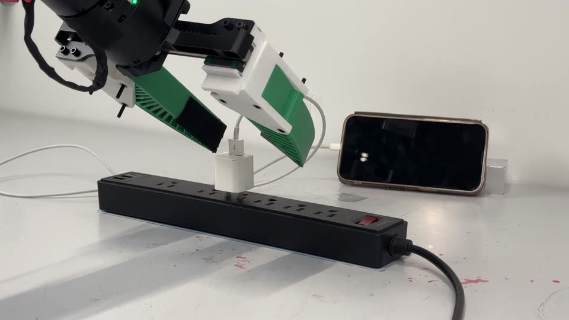

# VisualForce

### Robot Learning with Visual Predicted Force

Haonan Chen\*, Feiyang Wu\*, Yuxiang Ma, Mustafa Mete, Pengfei Ye,
Junxuan Shen, Cheng Zhu, Aurora Ruggeri, Kelvin Cheung, Jiayuan Mao,
Edward Adelson, Jiajun Wu, Robert D. Howe, Yilun Du
(\*equal contribution)

Harvard University &middot; MIT &middot;
University of Pennsylvania &middot; Stanford University

<a href="https://visual-force.github.io/">
  </a>
<a href="https://visual-force.github.io/static/papers/paper.pdf">
  </a>
<a href="LICENSE">
  </a>

<a href="https://visual-force.github.io/#teaser-title">
  </a>

<sub>Click the image to play the teaser video on the project page.</sub>

Force-aware manipulation usually depends on dedicated force or tactile sensors.
We instead predict force from the visible deformation of a compliant Fin Ray
gripper. A visual force estimator is trained on calibration data and used to
annotate task demonstrations; an action-force proposal policy is then trained on
those force-augmented demonstrations to jointly propose candidate actions and
the forces they are expected to produce. At test time we sample candidates and
execute the action whose predicted force is closest to a target drawn from the
demonstrations, so no force or tactile sensor is needed at deployment.

This repository is the implementation. VisualForce estimates contact force from
masked camera frames and uses that estimate to steer a frozen diffusion policy
at inference time. It contains code and launchers only: datasets, policy
checkpoints, force-estimator weights, SAM2 weights, rollouts, logs, and reports
are external artifacts.

## Repository layout

```text
src/                         force-estimator and steering code
scripts/                    estimator training, evaluation, preprocessing
third_party/forcelens_dp/   diffusion-policy code and task launchers
third_party/sam2/           SAM2 source submodule
docs/                       focused training and inference notes
tests/                      repository tests
assets/                     README media
requirements.txt            force-estimator dependencies
```

The robot-controller repository remains separate and is not duplicated here.
Do not start robot motion, inference, homing, or data collection without an
explicit operator request.

## Installation

```bash
git clone --recurse-submodules https://github.com/Raventhatfly/VisualForce.git
cd VisualForce
```

If the checkout was made without submodules, fetch them with
`git submodule update --init --recursive`.

Two environments are involved. The force estimator (`src/`, `scripts/`,
`segment_gripper.py`) runs from `requirements.txt`. Install a `torch` build
matching your CUDA version first; the reference environment is Python 3.9.15
with torch 2.8.0 on CUDA 12.8:

```bash
pip install torch==2.8.0 torchvision==0.23.0 \
  --index-url https://download.pytorch.org/whl/cu128
pip install -r requirements.txt
```

The diffusion policy (`third_party/forcelens_dp/`) uses the separate `robodiff`
conda environment. Use `conda_environment_real.yaml` instead for real-robot
deployment:

```bash
conda env create -f third_party/forcelens_dp/conda_environment.yaml
```

SAM2 is imported from the submodule through `SAM2_ROOT` (default
`third_party/sam2`) rather than installed as a package. Download its weights
before running any masking step:

```bash
third_party/sam2/checkpoints/download_ckpts.sh
```

`SAM2_CKPT` overrides the checkpoint path when the weights live elsewhere.

## Inference

Run task launchers from `third_party/forcelens_dp` with the `robodiff`
environment. Every force-aware command requires an external estimator:

```bash
cd /path/to/VisualForce/third_party/forcelens_dp
VISUALFORCE_CKPT=/path/to/force-estimator.pt \
  CKPT_PATH=/path/to/policy.ckpt \
  scripts/berry tts --no-interactive
```

`CKPT_PATH` is intentionally not given a repository default. Berry and Coke
may discover a compatible local policy under an ignored `outputs/` directory,
but formal runs should pass it explicitly. The estimator path is always
explicit; its version is not encoded in this repository.

The four completed experiments use one canonical controller contract from
`third_party/forcelens_dp/inference_profiles.py`:

| Profile | Target | Candidate ownership | Direct controller |
| --- | --- | --- | --- |
| `coke` | baseline-relative, 3.0 N default | gripper trajectory only | none |
| `berry` | baseline-relative, 5.0 N default | gripper trajectory only | gentle gripper feedback |
| `reorientation` (`flip`) | baseline-relative, 4.0 N default; activation 3.0 N | complete action chunk | none |
| `plug_insertion` (`plug`) | absolute, 12.0 N cap | complete action chunk | none |

Examples:

```bash
VISUALFORCE_CKPT=/path/to/force-estimator.pt CKPT_PATH=/path/to/berry.ckpt \
  scripts/berry tts --no-interactive

VISUALFORCE_CKPT=/path/to/force-estimator.pt CKPT_PATH=/path/to/coke.ckpt \
  scripts/coke tts

VISUALFORCE_CKPT=/path/to/force-estimator.pt CKPT_PATH=/path/to/reorientation.ckpt \
  scripts/flip tts

VISUALFORCE_CKPT=/path/to/force-estimator.pt CKPT_PATH=/path/to/plug.ckpt \
  scripts/plug tts
```

Use `baseline`, `raw_dp`, or `dp` for monitor-only comparisons. These commands
must use the same task-compatible frozen policy checkpoint as the matching TTS
run. TTS candidate sampling is learned policy-force selection; it is not a
hardware safety controller or an axial admittance controller.

All task-specific defaults and overrides are documented by:

```bash
scripts/berry --help
scripts/coke --help
scripts/flip --help
scripts/plug --help
```

The paper-compatible Coke action-force training pipeline is separate from the
legacy action-only training command:

```bash
scripts/coke force-output dry-run
scripts/coke force-output build
scripts/coke force-output label
scripts/coke force-output train
```

It trains an explicit 9D action vector: eight robot-action dimensions followed
by the magnitude of `Fz`. Label generation requires `VISUALFORCE_CKPT` and an
external dataset; generated views are ignored and are not part of this repo.

## Force estimator

The estimator entry points live at the repository root:

```bash
python segment_gripper.py data/<external-dataset>/
python scripts/train.py --data-dir data/<external-dataset>/ --output <external-output>
python scripts/evaluate.py --checkpoint /path/to/force-estimator.pt --data-dir data/<external-dataset>/
```

No dataset path, estimator version, checkpoint name, or generated report is
part of the formal repository configuration. Use `docs/training.md` and
`docs/inference.md` for data shape, model compatibility, masking, and rollout
format.

## Testing

Use the project environment and avoid writing pytest caches into the checkout:

```bash
PYTHONDONTWRITEBYTECODE=1 python -m pytest -p no:cacheprovider
```

The profile tests are hardware-independent. Launcher tests that start the GPU
preflight require an NVIDIA runtime and explicit external checkpoints.

## Privacy and artifact boundary

Do not commit datasets, checkpoint files, rollout videos, force logs, reports,
machine-specific absolute paths, usernames, host addresses, or experiment
version identifiers. Keep those values in local environment variables or
ignored artifact directories.

## Citation

```bibtex
@misc{chen2026visualforce,
  title  = {Robot Learning with Visual Predicted Force},
  author = {Chen, Haonan and Wu, Feiyang and Ma, Yuxiang and Mete, Mustafa and
            Ye, Pengfei and Shen, Junxuan and Zhu, Cheng and Ruggeri, Aurora and
            Cheung, Kelvin and Mao, Jiayuan and Adelson, Edward and Wu, Jiajun and
            Howe, Robert D. and Du, Yilun},
  year   = {2026},
  note   = {Manuscript},
  url    = {https://visual-force.github.io/}
}
```

## License

Project-authored code is released under the MIT License. Components under
`third_party/` retain their own upstream licenses and notices; in particular,
the SAM2 submodule is distributed under Apache-2.0 and the diffusion-policy
component includes its own MIT notice.
